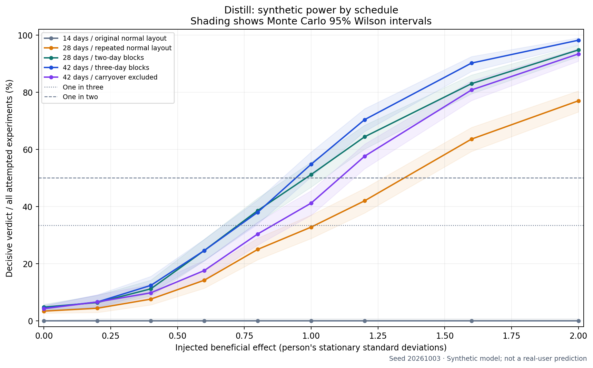

# Simulation and power

Generated by `pnpm sim:power`. These are synthetic model results, not estimates from real wearable users. Full counts, scenarios, seeds and Wilson 95% intervals are in [power-results.json](../data/power-results.json).



## Method and assumptions

Each attempt generates a new seeded person, runs the actual baseline, registration, daily check-in and statistics code, and counts any failed baseline or insufficient data as Inconclusive. No attempts are discarded. New experiments test help and hurt with a shared 5% budget; legacy saved rules stay unchanged. Exact tests enumerate the original constrained block assignment space. Intervals are disabled for power-only cells; this does not change the test or verdict.

The reference outcome is total sleep. Effects are in each person’s stationary standard deviation, before clipping; HRV uses log space with a lognormal sensor model. The reported personal swing is a finite-sample MAD estimate and can differ from the injected unit. Baselines span the specified number of calendar nights, with illness and missing measurements excluded. Reference assumptions: AR(1) rho 0.35, weekend shift 0.25 swings, 2% illness, 10% missing taps, 2% missing measurements and independent sensor noise equal to 10% of the marginal standard deviation. Missing taps, illness and missing metrics are independent of outcome and assignment unless a stress scenario says otherwise. This is an assumption, not established behavior in real users.

Means, bounds, person heterogeneity, autocorrelation and noise are declared engineering assumptions. Catalog swing text is preserved in model provenance; numeric conversions are transparent in `packages/sim/src/model.ts`. Other outcomes are model sensitivity checks, not clinical recommendations about raising/lowering those measurements. HRV effects are injected in log units; interval coverage is assessed in the raw units that the card displays.

AR(1) innovations preserve stationary marginal variance ([Forecasting: Principles and Practice](https://otexts.com/fpp3/AR.html)). Monte Carlo proportions include [Wilson binomial intervals](https://www.itl.nist.gov/div898/handbook/prc/section2/prc241.htm). The exact randomization null is a sharp no-effect null, not a claim of validity under arbitrary treatment-dependent missingness ([Berkeley randomization notes](https://www.stat.berkeley.edu/~stark/Teach/S240/Notes/ch3.htm)).

## Schedule comparison

Every percentage below includes its Monte Carlo 95% interval. Power is decisive/all attempts. At zero effect a decisive result is a false positive. Wrong-direction rate is wrong verdict/all attempts, not wrong/decisive.

| Schedule | Null false positive | Power at 0.8 | Power at 1.2 | Wrong direction at 0.8 |
| --- | --- | --- | --- | --- |
| 14 days / original normal layout | 0.0% [0.0, 0.2] (supported) | 0.0% [0.0, 0.8] | 0.0% [0.0, 0.8] | 0.0% [0.0, 0.8] |
| 14 days / original carryover layout | 0.0% [0.0, 0.2] (supported) | 0.0% [0.0, 0.8] | 0.0% [0.0, 0.8] | 0.0% [0.0, 0.8] |
| 28 days / repeated normal layout | 3.4% [2.7, 4.3] (supported) | 25.0% [21.4, 29.0] | 42.0% [37.8, 46.4] | 0.0% [0.0, 0.8] |
| 28 days / two-day blocks | 4.8% [3.9, 5.8] (uncertain) | 38.6% [34.4, 42.9] | 64.4% [60.1, 68.5] | 0.0% [0.0, 0.8] |
| 42 days / three-day blocks | 4.5% [3.6, 5.4] (uncertain) | 38.0% [33.9, 42.3] | 70.4% [66.3, 74.2] | 0.0% [0.0, 0.8] |
| 42 days / carryover excluded | 4.3% [3.5, 5.2] (uncertain) | 30.4% [26.5, 34.6] | 57.6% [53.2, 61.9] | 0.0% [0.0, 0.8] |

Null control “supported” means the entire Monte Carlo interval is at or below 5%; “uncertain” overlaps 5%; “failed” is entirely above 5%. This classification distinguishes sampling uncertainty from evidence of excess errors.

## Sensitivity and harm checks

| Scenario | Null false positive | Power +0.8 | Power +1.2 | Power −1.2 | Wrong direction −1.2 |
| --- | --- | --- | --- | --- | --- |
| INVALID: omit bad on-nights | 11.1% [9.8, 12.6] (failed) | 66.0% [61.7, 70.0] | 86.0% [82.7, 88.8] | 39.8% [35.6, 44.2] | 0.0% [0.0, 0.8] |
| 7-day baseline | 4.8% [3.9, 5.8] (uncertain) | 42.0% [37.8, 46.4] | 71.0% [66.9, 74.8] | 69.0% [64.8, 72.9] | 0.0% [0.0, 0.8] |
| 56-day baseline | 5.0% [4.1, 6.0] (uncertain) | 40.4% [36.2, 44.8] | 68.8% [64.6, 72.7] | 69.6% [65.4, 73.5] | 0.0% [0.0, 0.8] |
| AR(1) rho 0 | 5.1% [4.2, 6.2] (uncertain) | 48.0% [43.7, 52.4] | 81.2% [77.5, 84.4] | 79.8% [76.1, 83.1] | 0.0% [0.0, 0.8] |
| AR(1) rho 0.7 | 3.6% [2.9, 4.6] (supported) | 39.6% [35.4, 44.0] | 66.2% [61.9, 70.2] | 65.2% [60.9, 69.2] | 0.0% [0.0, 0.8] |
| 0% missed taps | 5.0% [4.1, 6.0] (uncertain) | 39.0% [34.8, 43.3] | 72.0% [67.9, 75.8] | 76.2% [72.3, 79.7] | 0.0% [0.0, 0.8] |
| 25% missed taps | 4.2% [3.4, 5.2] (uncertain) | 36.4% [32.3, 40.7] | 64.8% [60.5, 68.9] | 62.4% [58.1, 66.5] | 0.0% [0.0, 0.8] |
| Legacy benefit-only tail | 4.3% [3.5, 5.2] (uncertain) | 56.2% [51.8, 60.5] | 84.8% [81.4, 87.7] | 0.0% [0.0, 0.8] | 0.0% [0.0, 0.8] |
| Two-night carryover; only first excluded | 3.9% [3.1, 4.8] (supported) | 19.8% [16.5, 23.5] | 40.2% [36.0, 44.6] | 41.2% [37.0, 45.6] | 0.0% [0.0, 0.8] |
| Assignment-dependent missing taps | 5.1% [4.2, 6.1] (uncertain) | 34.4% [30.4, 38.7] | 64.6% [60.3, 68.7] | 63.2% [58.9, 67.3] | 0.0% [0.0, 0.8] |
| sleepLatencyMinutes | 4.5% [3.6, 5.4] (uncertain) | 39.4% [35.2, 43.7] | 69.4% [65.2, 73.3] | 68.6% [64.4, 72.5] | 0.0% [0.0, 0.8] |
| deepSleepMinutes | 3.6% [2.9, 4.5] (supported) | 38.6% [34.4, 42.9] | 71.6% [67.5, 75.4] | 71.0% [66.9, 74.8] | 0.0% [0.0, 0.8] |
| remSleepMinutes | 4.5% [3.7, 5.6] (uncertain) | 37.4% [33.3, 41.7] | 68.4% [64.2, 72.3] | 72.8% [68.7, 76.5] | 0.0% [0.0, 0.8] |
| wakeAfterSleepOnsetMinutes | 4.6% [3.8, 5.6] (uncertain) | 40.2% [36.0, 44.6] | 69.2% [65.0, 73.1] | 66.8% [62.6, 70.8] | 0.0% [0.0, 0.8] |
| sleepEfficiencyPercent | 4.6% [3.8, 5.6] (uncertain) | 41.2% [37.0, 45.6] | 71.6% [67.5, 75.4] | 71.0% [66.9, 74.8] | 0.0% [0.0, 0.8] |
| overnightHrvMs | 4.0% [3.3, 5.0] (uncertain) | 40.2% [36.0, 44.6] | 70.6% [66.5, 74.4] | 72.0% [67.9, 75.8] | 0.0% [0.0, 0.8] |
| restingHeartRateBpm | 4.7% [3.8, 5.7] (uncertain) | 38.4% [34.2, 42.7] | 69.2% [65.0, 73.1] | 66.8% [62.6, 70.8] | 0.0% [0.0, 0.8] |
| breathingRatePerMinute | 3.6% [2.9, 4.5] (supported) | 41.2% [37.0, 45.6] | 69.0% [64.8, 72.9] | 70.2% [66.0, 74.0] | 0.0% [0.0, 0.8] |
| skinTemperatureDeviationC | 5.0% [4.1, 6.0] (uncertain) | 40.2% [36.0, 44.6] | 70.0% [65.8, 73.9] | 74.8% [70.8, 78.4] | 0.0% [0.0, 0.8] |

## Interval coverage

The current percentile bootstrap resamples scheduled whole blocks within condition, using 1,000 replicates per attempted interval. Coverage means that the 90% displayed interval includes the average paired, clipped raw treatment effect on analyzed dates (including hypothetical on values for off dates). The table conditions on an available interval; availability is reported separately so failed intervals cannot disappear. A 90% label does not establish 90% coverage under autocorrelation.

| Scenario | Effect | Interval available | Conditional coverage |
| --- | --- | --- | --- |
| HRV interval coverage | 0 | 100.0% [98.5, 100.0] | 86.4% [81.6, 90.1] |
| HRV interval coverage | 0.8 | 100.0% [98.5, 100.0] | 87.6% [82.9, 91.1] |
| HRV interval coverage | 1.2 | 100.0% [98.5, 100.0] | 87.6% [82.9, 91.1] |
| Reference interval coverage | 0 | 100.0% [98.5, 100.0] | 86.0% [81.2, 89.8] |
| Reference interval coverage | 0.8 | 100.0% [98.5, 100.0] | 86.0% [81.2, 89.8] |
| Reference interval coverage | 1.2 | 100.0% [98.5, 100.0] | 86.0% [81.2, 89.8] |
| Independent-night interval coverage | 0 | 100.0% [98.5, 100.0] | 84.4% [79.4, 88.4] |
| Independent-night interval coverage | 0.8 | 100.0% [98.5, 100.0] | 84.4% [79.4, 88.4] |
| Independent-night interval coverage | 1.2 | 100.0% [98.5, 100.0] | 84.4% [79.4, 88.4] |
| High-correlation interval coverage | 0 | 100.0% [98.5, 100.0] | 89.6% [85.2, 92.8] |
| High-correlation interval coverage | 0.8 | 100.0% [98.5, 100.0] | 89.6% [85.2, 92.8] |
| High-correlation interval coverage | 1.2 | 100.0% [98.5, 100.0] | 89.6% [85.2, 92.8] |

## Gate, labels and protocol decision

The original 14-day layouts produce no decisive verdict, even at 2.0 swings. The spreadsheet’s “0.8 roughly one in three; 1.2 better than even” claim is **not valid for those layouts**. For the explicitly configured 42-day reference, measured power is 38.0% [33.9, 42.3] at 0.8 and 70.4% [66.3, 74.2] at 1.2.

Keep the 0.8 routing threshold as a candidate-priority threshold, not a promise of a two-week answer. Revise the interpretation of the sheet’s good/fair/low labels: they are source expectations, not validated personal probabilities. New `powerGuidance` reports an empirical good/fair/low label only for this named reference protocol (good ≥50%, fair ≥33⅓%, low below that), uses a conservative lower-bound label, and returns unavailable for unsupported protocols or effects. The source workbook and literature effect estimates have not been rewritten.

The 42-day layout is available as an explicit simulation-backed option; the saved 14-day default is not silently replaced. Changing the duration offered to people requires a product decision about six weeks of participation. Existing registrations, seeds, policies and baseline snapshots remain locked. Simulations support checking false positives under the tested assumptions, not declaring universal validation. Interval undercoverage and treatment-dependent missingness remain limitations; the result card suppresses intervals without demonstrated coverage.

## Reproducibility

```json
{
  "version": 1,
  "sourceHashScope": "Simulation and calculation sources; verdict presentation is excluded",
  "seed": 20261003,
  "trials": 500,
  "nullTrials": 2000,
  "coverageTrials": 250,
  "bootstrapIterations": 1000,
  "attemptedTrials": 105500,
  "sourceHash": "058f323b7f95d08c6934801f57d997b582b81099be157ff6f3d41b71ebb8dfde",
  "generator": "stationary AR(1), independent streams, bounded metrics, lognormal HRV",
  "metricModels": {
    "totalSleepMinutes": {
      "name": "Total sleep",
      "mean": 420,
      "swing": 45,
      "lower": 120,
      "upper": 720,
      "sourceRow": 2,
      "sourceSwingText": "about 45 min"
    },
    "sleepLatencyMinutes": {
      "name": "Time to fall asleep",
      "mean": 22,
      "swing": 10,
      "lower": 0,
      "upper": 120,
      "sourceRow": 3,
      "sourceSwingText": "about 10 min"
    },
    "deepSleepMinutes": {
      "name": "Deep sleep",
      "mean": 70,
      "swing": 15,
      "lower": 0,
      "upper": 240,
      "sourceRow": 4,
      "sourceSwingText": "about 15 min"
    },
    "remSleepMinutes": {
      "name": "REM sleep",
      "mean": 95,
      "swing": 15,
      "lower": 0,
      "upper": 300,
      "sourceRow": 5,
      "sourceSwingText": "about 15 min"
    },
    "wakeAfterSleepOnsetMinutes": {
      "name": "Time awake during the night",
      "mean": 30,
      "swing": 12,
      "lower": 0,
      "upper": 180,
      "sourceRow": 6,
      "sourceSwingText": "about 12 min"
    },
    "sleepEfficiencyPercent": {
      "name": "Share of time in bed asleep",
      "mean": 88,
      "swing": 4,
      "lower": 30,
      "upper": 100,
      "sourceRow": 7,
      "sourceSwingText": "about 4 points"
    },
    "overnightHrvMs": {
      "name": "Overnight HRV",
      "mean": 60,
      "swing": 0.1980422004353651,
      "lower": 5,
      "upper": 250,
      "sourceRow": 8,
      "sourceSwingText": "about 12 ms (about 20% of the person's average)"
    },
    "restingHeartRateBpm": {
      "name": "Resting heart rate",
      "mean": 56,
      "swing": 2.5,
      "lower": 35,
      "upper": 110,
      "sourceRow": 9,
      "sourceSwingText": "about 2.5 bpm"
    },
    "breathingRatePerMinute": {
      "name": "Breathing rate",
      "mean": 15,
      "swing": 0.5,
      "lower": 8,
      "upper": 30,
      "sourceRow": 10,
      "sourceSwingText": "about 0.5"
    },
    "skinTemperatureDeviationC": {
      "name": "Skin temperature",
      "mean": 0,
      "swing": 0.25,
      "lower": -3,
      "upper": 3,
      "sourceRow": 11,
      "sourceSwingText": "about 0.25"
    }
  },
  "inference": "exact constrained block randomization; dual tails at 0.025 each unless explicitly legacy",
  "quick": false
}
```

Run `pnpm sim:power` to regenerate the full checked-in report and JSON. Run `pnpm sim:plot` after installing `scripts/requirements-sim.txt`. `pnpm sim:power --quick` writes only `.local/power-quick.json` and does not replace the report. `pnpm sim:power --check` checks source provenance. Local checks do not waive real-provider acceptance or spreadsheet source review.
